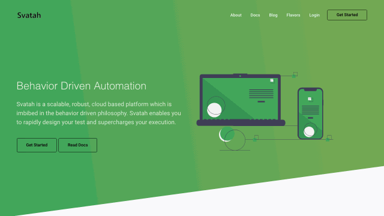
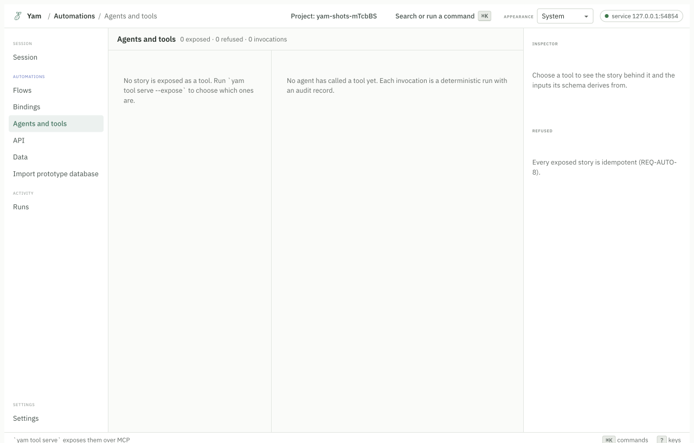
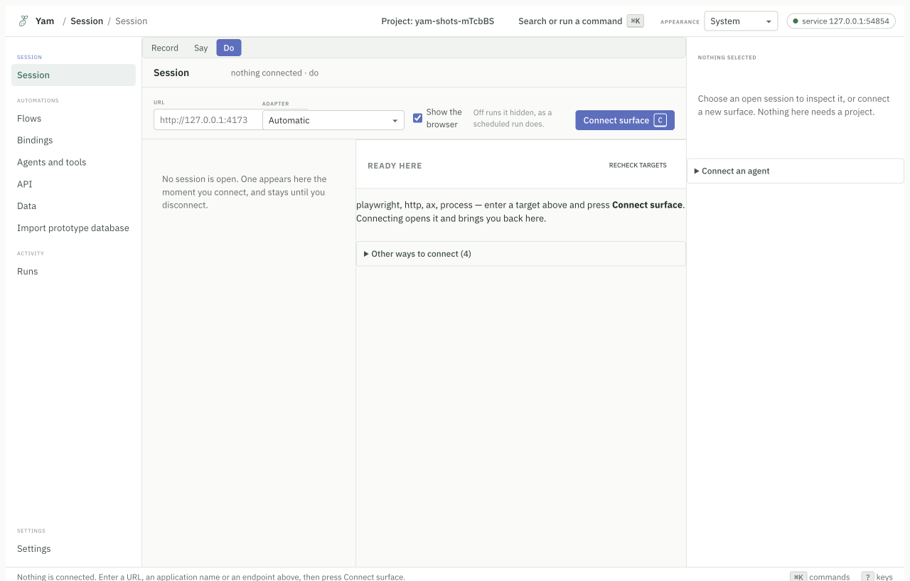
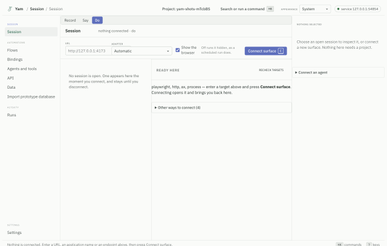
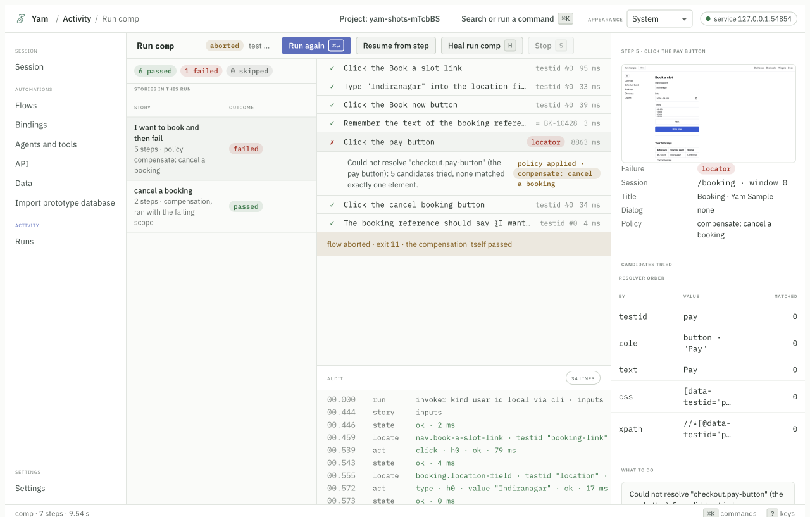

<h1>
  <picture>
    <source media="(prefers-color-scheme: dark)" srcset="packages/ui/brand/yam-color-dark-horizontal.svg">
    
  </picture>
</h1>

**Give an AI agent hands. It drives a browser, a desktop app, an API or a terminal, and you can watch it work.**

Yam is an automation runtime from [Svatah Labs](https://github.com/SvatahLabs).
It ships an MCP server, so any agent that speaks the Model Context Protocol can
drive a real application through one set of tools. You and the agent share the
same session, so you can watch what it does and take the controls back.

Everything the agent does can be saved and replayed later with no model running
at all.



Yam opening a site, going to the docs, filling a login form, and reading the
error. Every step went through Yam's own tools.

## Give an agent hands

### What your agent gets

Point your agent at Yam's MCP server and it gets 14 tools that work without a
Yam project. Point it at a project and it gets 8 more.

| What it can do | Tool |
|---|---|
| See what there is to drive on this machine | `surface_targets` |
| Open a browser, an app, an API or a terminal | `surface_connect` |
| Read the screen as a list of elements | `surface_snapshot` |
| Click, type, press a key, navigate | `surface_act` |
| Read a title, a URL, an element's text | `surface_read` |
| Test whether something is true, and see what it saw | `surface_check` |
| Take a picture | `surface_screenshot` |
| Ask about one element | `surface_describe` |
| Ask what this kind of target can do | `surface_capabilities` |
| Send an HTTP request | `surface_request` |
| See every open session, including yours | `surface_sessions` |
| See what has happened in this session | `surface_events` |
| Take the controls, or hand them back | `surface_control` |
| Close a session | `surface_close` |

Four things make this different from handing an agent a browser library.

**One set of tools for four kinds of target.** The same `snapshot` and `act`
work on a web page, a macOS window, an HTTP API and a terminal program. Your
agent does not learn a new interface for each one.

**Elements have references, not selectors and not screen positions.**
`snapshot` hands back `r12`, and `act` takes `r12`. The agent never guesses a
CSS selector and never clicks a coordinate, so nothing breaks when the window
moves or the page is styled differently.

**You and the agent share one session.** Yam keeps sessions in a single broker
on your machine. If the agent opens a browser, you can see that same browser in
the desktop app. `surface_control` decides who is driving, and you can take a
target back at any time.

**What the agent did can become a test.** Yam can record the whole session and
compile it into a flow you replay later. That replay uses no model, so it is
fast, free, and the same every time.

### Set it up

You need [Node 22 or newer](https://nodejs.org). Add this to your agent's MCP
server list:

```json
{ "mcpServers": { "yam": { "command": "npx", "args": ["-y", "@svatah/yam-mcp"] } } }
```

For Claude Code, one line does it:

```bash
claude mcp add yam -- npx -y @svatah/yam-mcp
```

To drive a web browser, install Chromium once:

```bash
npx playwright install chromium
```

You do not need a browser to drive a desktop app, a terminal, or an HTTP API.

An agent starts no program and drives no desktop application you have not
named. To let it drive a terminal, list the program; to let it drive an
application that is running, list the application:

```json
{ "mcpServers": { "yam": { "command": "npx", "args": ["-y", "@svatah/yam-mcp", "--allow-program", "bash", "--allow-app", "Notes"] } } }
```

A program you allow runs as you, and an application you allow is driven as you,
so allow what you would let the agent type into yourself. Web pages need no
list.

If your agent cannot start a program, run the server over HTTP instead:

```bash
npx -y @svatah/yam-mcp --http
```

### Use it

A session is five steps. Connect, look, act, read, close.

```
surface_connect    open https://example.com        -> session id
surface_snapshot   the elements, each with a ref
surface_act        click ref r12
surface_read       the title, or an element's text
surface_close      done
```

Every tool takes an optional `intent`, which is a short sentence saying why the
agent is doing something. "Sign in as the test user" is an intent. "Click r14"
is not. Intents are what let a session become a test later, so it is worth
passing them.

Anything typed into a password field is kept out of that record. So is any value
the agent names in `secrets`, and the test asks for it as a `secret` input
instead.

Give the server a project directory and it gets the project tools too:

```json
{ "mcpServers": { "yam": { "command": "npx", "args": ["-y", "@svatah/yam-mcp", "/path/to/project"] } } }
```

| Tool | What it does |
|---|---|
| `yam_compile` | Turn the flows into a plan. |
| `yam_lint` | Read the flows and report problems. |
| `yam_run` | Run the plan and report every step. |
| `yam_record` | Bind a flow to the real elements. |
| `yam_heal` | Propose repairs after a failed run. |
| `yam_bindings` | Read the bindings store. |
| `yam_results` | Read a run's results. |
| `surface_trajectory` | Where this session is being recorded, and how much of it there is. |

These run the same code the `yam` command runs. An agent and a person working on
the same project get the same answers.

### Watch it, and take over

Open the desktop app while the agent works. Its session shows up in the same
list as yours.



The app says who holds each target. If the agent gets stuck, you take the target
back and finish by hand. When you are done, you can hand it back.

### Turn the session into a test

This is the part that pays for itself. An agent figuring out a task is slow and
costs money every time. Doing it once and replaying it costs nothing.

```bash
yam explore --name "Sign in"
```

Yam serves the tools, records what the agent does, and writes a proposal under
`proposals/`. You read it, and nothing touches your flows until you accept it.
After that, `yam run` replays the same steps with no model involved.

You can also go the other way and expose a test you already have as a tool the
agent calls by name:

```bash
yam tool serve --expose "Sign in"
```

The agent passes the inputs and gets the outputs back. The run is recorded as
invoked by an agent, so your audit log says who asked.

Full details: [Yam and MCP](docs/mcp.md).

## Write a test in plain English

The same engine works without an agent. You describe what you want in sentences,
Yam drives the real app once to learn which element each sentence means, and
every run after that is a replay.

**1. Make a project.**

```bash
npm install -g @svatah/yam
yam init my-tests
cd my-tests
```

**2. Write a story.** Open `flows/first.flow` and write sentences:

```
story (tags=smoke): Sign in
inputs: username: string, password: secret
  Go to "/login"
  Type {input.username} into the username field
  Type {input.password} into the password field
  Click the sign in button
  The dashboard heading should be visible

test: Sign in
```

**3. Record it.** Yam opens the app and watches you click:

```bash
yam record --flow flows/first.flow
```

Yam writes what it learned into `bindings/`. Those are plain YAML files. You can
read them, review them, and commit them.

**4. Replay it.** No model runs this time:

```bash
yam run
```

The exit code is the answer. `0` means everything passed. Every code is listed
by `yam help exit-codes`.

**5. Repair it when the page changes:**

```bash
yam heal
```

Check your install with `yam --version` and `yam surface doctor`. Doctor prints
one line per adapter and says what is ready, what this computer cannot do, and
what is missing. It never guesses.

Longer walkthrough: [Your first flow](docs/getting-started/first-flow.md).

## The desktop app

`yam ui` gives you a version in the terminal. The desktop app gives you the same
screens with a mouse.



Connect to a browser, an app, an API, or a terminal from one screen. Nothing on
this screen needs a project.



When a run fails, Yam shows you why. It lists every way it tried to find the
element and how many things matched.



## What Yam can drive

Yam talks to each kind of target through an adapter. How far each adapter has
actually been driven is measured, not claimed. The numbers come from real runs
and live in the [support matrix](docs/reference/generated/support-matrix.md).

| Target | Adapter | Needs |
|---|---|---|
| Web browser | `playwright` | Chromium, installed once |
| A browser you already have open | `bidi` | Chrome or Firefox with a BiDi endpoint |
| macOS apps | `ax` | macOS, and the Accessibility permission |
| Windows apps | `uia` | Windows |
| Linux apps | `atspi` | Linux with an accessibility bus |
| Phones and tablets | `appium` | An Appium server and a device |
| HTTP APIs | `http` | Nothing |
| Terminal programs | `process` | Nothing |

Six of these need no extra download. Read the
[support matrix](docs/reference/generated/support-matrix.md) before you pick
one. An adapter being listed is not proof that it works on your machine, and the
matrix says which ones were driven in the last measured run.

## Healing, with numbers

Tests stop breaking when the page changes. Yam saves five ways to find each
element, plus a fingerprint of what the element looked like. When a button moves
or gets renamed, Yam finds it again from that fingerprint. It marks the run
`healed`, never `passed`, so you always know a repair happened.

A healing claim without a number is a slogan. These numbers come from twenty
deliberate interface changes in the sample app.

| | Without test ids | With test ids |
|---|---|---|
| Elements found again | **92.3%** (48 of 52) | 78.9% (15 of 19) |
| Repairs onto the wrong element | 0 | 0 |
| Bindings that stopped working | 0 | 0 |
| Model calls | none | none |

The first row is the measure the eval calls Relocalize-only recovery. It counts
a repair only when the element found is the one the binding was recorded on, not
merely an element that could be found.

The headline is the harder case. An app with a `data-testid` on every control
barely needs healing, so a number taken there measures the app and not the
healer. Both are published so you can see the gap.

Method and per-change tables: [`reports/eval-healing.md`](reports/eval-healing.md).
Regenerate them with `pnpm eval:healing`.

## One plan, three ways

The same compiled plan runs as any of these. You do not rewrite it.

| Way | What it is | Command |
|---|---|---|
| **Test** | Passes or fails. Good for CI. | `yam run` |
| **Workflow** | A function with inputs, outputs and retries. | `yam workflow run` |
| **Tool** | A tool an AI agent can call over MCP. | `yam tool serve` |

Read [One plan, three ways](docs/getting-started/one-plan-three-ways.md).

## Already have Playwright tests?

You can take one piece on its own. Add bindings and healing to a Playwright
suite you already have. No flow language, no compiler, no model.

```bash
npm install --save-dev @svatah/yam-playwright-test
```

```ts
import { test, expect } from "@svatah/yam-playwright-test";

test("sign in", async ({ page, bind }) => {
  await page.goto("/login");
  await (await bind("login.username-field", "the username field")).fill("me@example.com");
  await (await bind("login.sign-in-button")).click();
  await expect(page).toHaveURL(/dashboard/);
});
```

`bind()` returns a normal Playwright locator, so everything you already do still
works. Read the [Playwright quick start](docs/getting-started/playwright-quick-start.md),
or the runnable version in
[`examples/plain-playwright/README.md`](examples/plain-playwright/README.md).

## Documentation

| If you want to | Read |
|---|---|
| set up an agent | [Yam and MCP](docs/mcp.md) |
| install it and run something | [Setup](docs/setup.md) |
| see everything Yam does | [Features](docs/features.md) |
| learn from working examples | [Examples](docs/examples.md) |
| look up a command, a tool or an endpoint | [API reference](docs/api.md) |
| understand how it works | [Concepts](docs/concepts) |
| work on Yam itself | [Developer guide](docs/developer-guide.md) |
| send a change | [Contributing](CONTRIBUTING.md) |

Everything else is in [`docs/`](docs/README.md).

## What you install

Three packages. Which one depends on what you are doing.

| Package | What it is |
|---|---|
| [`@svatah/yam-mcp`](packages/mcp) | The MCP server, for an agent. Run it with `npx`. |
| [`@svatah/yam`](packages/cli) | The `yam` command, for a person. |
| [`@svatah/yam-contract`](packages/contract) | The shared operation list. You never install it directly. |

There is also [`@svatah/yam-playwright-test`](packages/playwright-test) if you
only want bindings in an existing Playwright suite.

## Status

Version 0.1.0 is on npm: every command above installs it. The desktop app's
installers are attached to the
[GitHub release](https://github.com/SvatahLabs/Yam/releases/tag/v0.1.0) and are
not signed yet, so macOS and Windows will warn before opening them. The Python
and Java clients are not published to PyPI or Maven Central; build them from
[`clients/`](clients/README.md).

Known gaps are written down rather than hidden. See
[CHANGELOG.md](CHANGELOG.md). The specification is the source of truth and
lives in [`docs/spec/`](docs/spec/). It is written before the code, not after.

## Licence

Apache-2.0. See [LICENSE](LICENSE).
