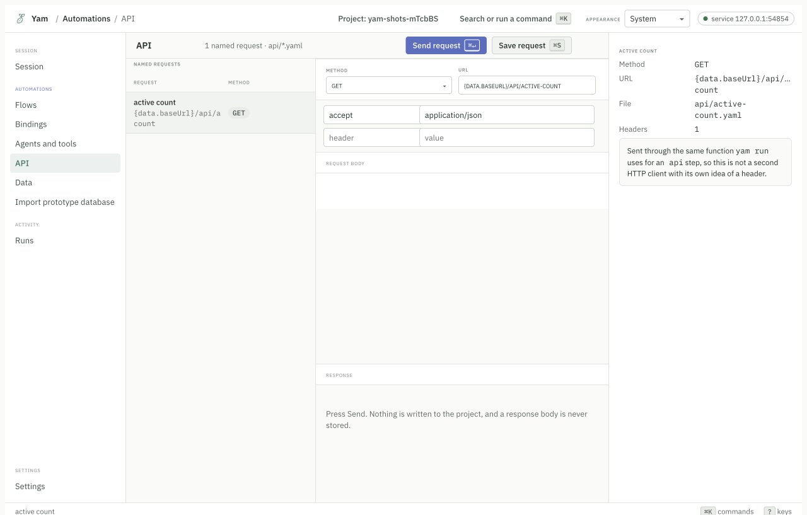

# Examples

Working examples, smallest first. Every flow here is a real one from this
repository, so it compiles.

## A login test

The story says what happens. The `test:` line says to run it as a pass or fail
check.

```
story (tags=smoke): I want to validate login
inputs: email: string, password: secret
outputs: enterprise: string
  Click the sign in button
  Type {input.email} into the username field
  Type {input.password} into the password field
  Click the login button
  Click the Schedule Build link
  Remember the text of the schedule heading as enterprise
  The schedule heading should say {enterprise}
```

Three things to notice.

`{input.email}` reads a value you pass in. `Remember the text of ... as
enterprise` saves something for later. The last line checks it.

Run it:

```bash
yam record --flow flows/login.flow    # once, to learn the elements
yam run                               # every time after
```

## Passing values in

Three ways, and the first one that has a value wins.

```bash
yam run --input email=me@example.com                 # 1. on the command line
YAM_INPUT_EMAIL=me@example.com yam run               # 2. in the environment
```

```yaml
# 3. in data.yaml
user:
  email: "me@example.com"
```

Then the story reads `{data.user.email}`.

Use the environment for secrets. A value on the command line shows up in the
process list, where other users can read it.

## Using one story's output in another

```
story: I want to validate text
  Type {data.user.email} into the username field
  Type {data.user.password} into the password field
  Click the login button
  Click the Schedule Build link
  The schedule heading should say {I want to validate login.enterprise}
```

`{I want to validate login.enterprise}` reads the output of the story named
`I want to validate login`.

## Running stories in order

```
compose: I want to validate stories
  I want to validate login
  I want to validate logout
  I want to validate text
```

`compose` runs stories one after another in one session. The browser stays open
between them, so the second story starts where the first finished.

## Cleaning up when something fails

If a booking half completes, you want to cancel it. That is compensation.

```
story: I want to book and then fail
  policy: compensate: cancel a booking
  Click the Book a slot link
  Type "Indiranagar" into the location field
  Click the Book now button
  Remember the text of the booking reference as booking
  Click the pay button
  The booking reference should say {booking}

story: cancel a booking
  Click the cancel booking button
  The booking reference should say {I want to book and then fail.booking}
```

When the pay step fails, Yam runs `cancel a booking` and marks the run aborted.
The report says whether the cleanup itself passed.


## Testing an HTTP API

Saved requests live in `api/`. They run like stories and share the same data.

```bash
yam surface connect --url https://api.example.com --adapter http
yam surface request --session <id> --method GET --path /health
```

In the app, the API screen keeps named requests you can rerun.



## Driving a macOS app

No browser needed.

```bash
yam surface connect --app "Calculator" --adapter ax
yam surface snapshot --session <id>
yam surface act --session <id> --ref r12 --action click
```

`snapshot` gives you the elements with stable references. `act` uses a
reference, not a screen position, so the run does not break when the window
moves.

This needs the macOS Accessibility permission. See [Setup](setup.md).

## Driving a terminal program

```bash
yam surface connect --url "bash -i" --adapter process
```

The `process` adapter opens a real pseudo-terminal. You can snapshot the screen,
send input, send signals, and read the exit code.

## Bindings in an existing Playwright suite

You do not have to adopt the flow language. This piece works on its own.

```bash
npm install --save-dev @svatah/yam-playwright-test
```

```ts
import { test, expect } from "@svatah/yam-playwright-test";

test("sign in", async ({ page, bind }) => {
  await page.goto("/login");
  await (await bind("login.username-field", "the username field")).fill("me@example.com");
  await (await bind("login.password-field")).fill(process.env.PASSWORD!);
  await (await bind("login.sign-in-button")).click();
  await expect(page).toHaveURL(/dashboard/);
});
```

Record the bindings once by clicking the elements:

```bash
YAM_MODE=record npx playwright test
```

Replay with no model:

```bash
npx playwright test
```

Repair after a redesign:

```bash
YAM_MODE=heal npx playwright test
```

The full walkthrough is
[`examples/plain-playwright/`](../examples/plain-playwright/README.md).

## Running in CI

```yaml
- run: npm install -g @svatah/yam
- run: npx playwright install --with-deps chromium
- run: yam check
- run: yam run
```

`yam run` exits `0` when everything passed. `6` means something only passed
because a binding was healed, which you probably want to review. `yam help
exit-codes` lists them all.

A complete workflow is in [`examples/ci/`](../examples/ci/).

## Running from cron

```bash
0 * * * * cd /srv/checks && /usr/local/bin/yam run --json >> /var/log/yam.log 2>&1
```

`--json` prints one JSON document on stdout and nothing else, so a log collector
can read it.

A complete setup is in [`examples/cron/`](../examples/cron/).

## Calling a story from code

```bash
yam workflow run --story "Sign in" --input username=me@example.com --json
```

You get typed outputs back. If it stops halfway and checkpoints are on, run it
again and it resumes from the last checkpoint instead of starting over.

## Letting an agent call a story

```bash
yam tool serve --expose "Sign in"
```

The story becomes an MCP tool. The agent calls it by name, passes the inputs, and
gets the outputs. The run is recorded as invoked by an agent, so your audit log
says who asked.

A complete client is in [`examples/mcp-agent/`](../examples/mcp-agent/).

## Letting an agent drive directly

Point the agent at the MCP server and it can use the same engine you do.

```json
{ "mcpServers": { "yam": { "command": "npx", "args": ["-y", "@svatah/yam-mcp"] } } }
```

A short session looks like this:

1. `surface_connect` with a URL. Yam opens the page.
2. `surface_snapshot`. The agent gets the elements and their references.
3. `surface_act` with a reference. The agent clicks or types.
4. `surface_read` for the title or the URL.
5. `surface_screenshot` for a picture.
6. `surface_close`.

You can watch the same session in the app the whole time.

## Letting an agent write the first draft

```bash
yam explore --name "Sign in"
```

Yam serves the surface tools, records what the agent does, and compiles it into
a proposal under `proposals/`. Nothing touches your flows until you accept it.

## More

- [`examples/`](../examples/) has the runnable versions of these.
- [Features](features.md) lists what else Yam does.
- [The flow language](flow-language.md) lists every sentence pattern.
