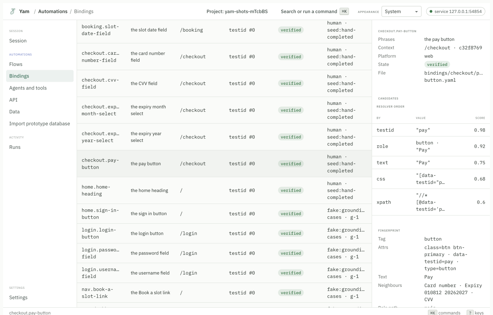
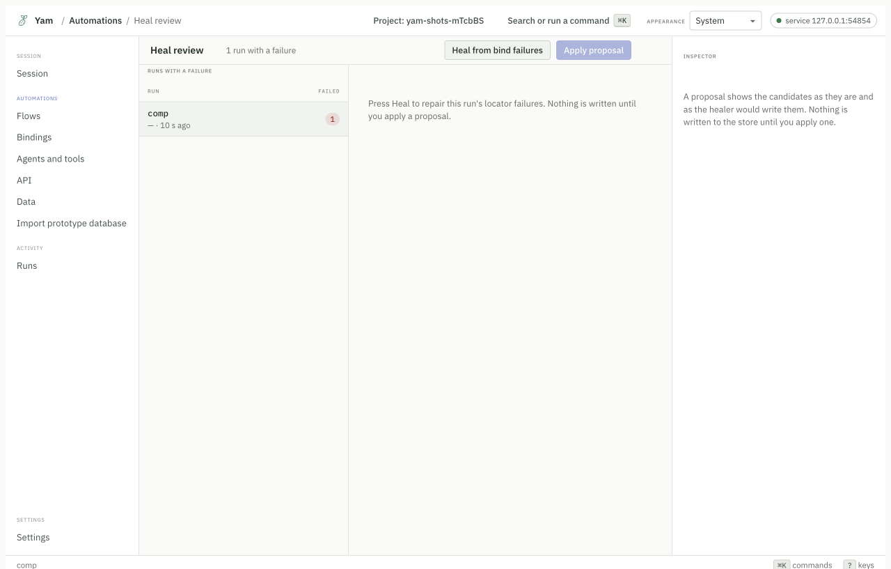
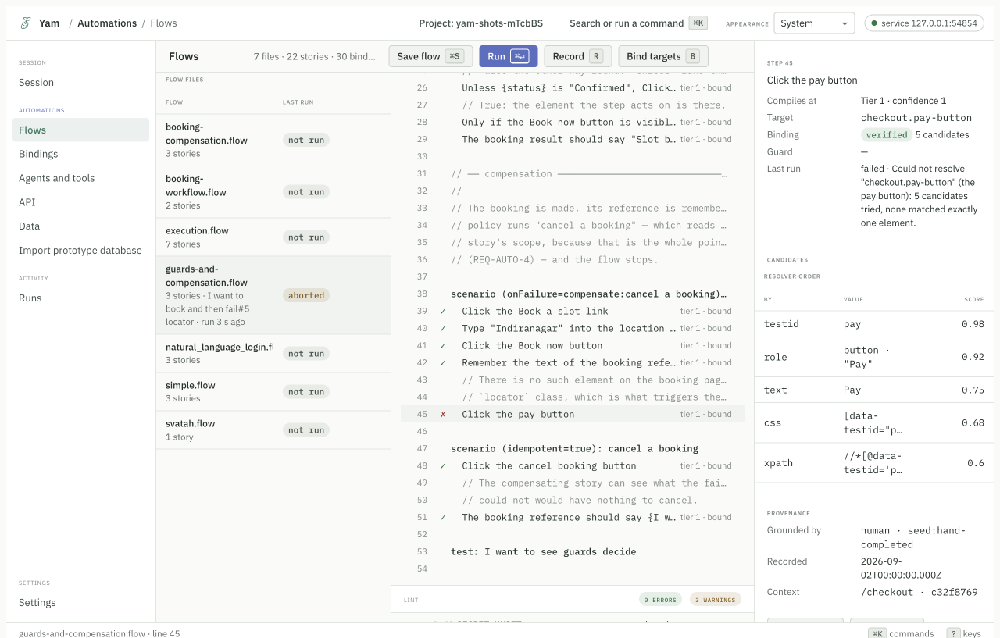
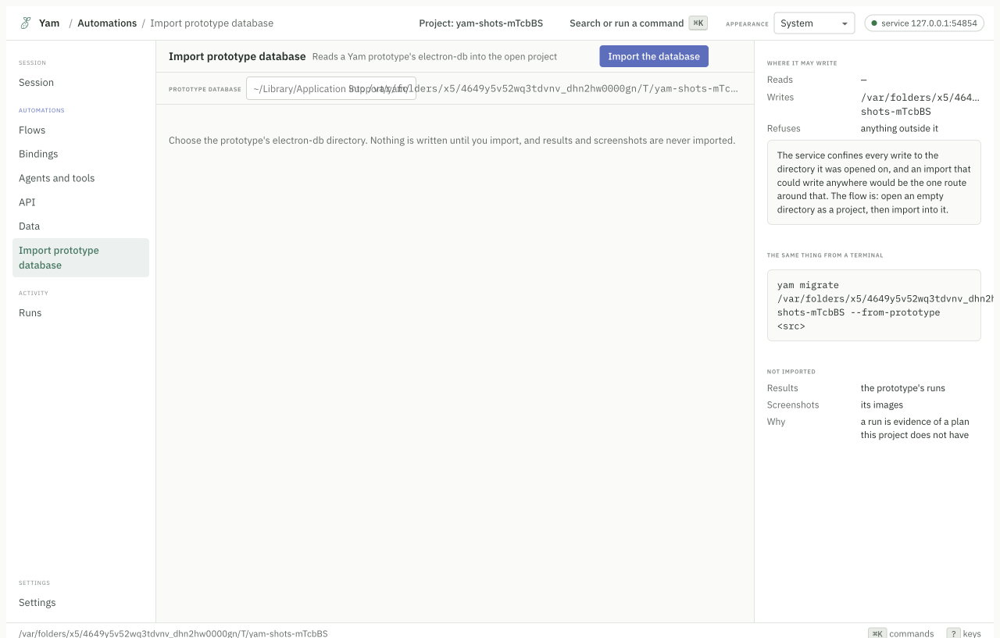

# Features

What Yam does, one feature at a time, with the command that runs it.

## Write tests in sentences

A flow is a text file. You write what you want, not how to find it.

```
story (tags=smoke): Sign in
inputs: username: string, password: secret
  Go to "/login"
  Type {input.username} into the username field
  Type {input.password} into the password field
  Click the sign in button
  The dashboard heading should be visible

test: Sign in
```

`story` is a named piece of behaviour. `inputs` says what it needs.
`test: Sign in` says to run it as a pass or fail check.

Sentences are compiled, not guessed at run time. `yam check` turns them into a
typed plan and tells you about anything it could not read.

Every sentence pattern is listed in
[the flow language reference](flow-language.md).

## Record once, replay for ever

`yam record` opens the real app and watches you. When you click a button, Yam
writes down five ways to find it again.

```bash
yam record --flow flows/first.flow
```

A binding file looks like this. You can read it and review it in a pull request.

```yaml
entries:
  - candidates:
      - by: "testid"
        attribute: "data-testid"
        value: "home-heading"
        score: 0.98
      - by: "role"
        role: "heading"
        name: "Deterministic automation, once described"
        score: 0.92
      - by: "text"
        value: "Deterministic automation, once described"
        score: 0.75
```

`yam run` replays the plan and reads those files. No model runs.



## Heal when the page changes

A front end changes. A button moves, a label is reworded, a class is renamed.
The usual result is a red test that was never really broken.

Yam saves a fingerprint of each element when it records. When the saved ways to
find it all stop working, Yam looks for the element that matches the fingerprint
best.

```bash
yam heal
```

Two rules keep this honest:

1. A healed run is marked `healed`, never `passed`. You always know.
2. Yam shows you the repair before it writes it. Nothing is written until you
   apply it.



Measured over twenty deliberate interface changes: 92.3% of degraded bindings
were found again, 0 were repaired onto the wrong element, and no model was
called. The method is in [`reports/eval-healing.md`](../reports/eval-healing.md).

## See why a run failed

When a step fails, Yam does not just say "element not found". It lists every way
it tried, in order, and how many things each one matched.


The screenshot on the right is the moment it failed. The audit log at the bottom
is every action with its timing. The table on the right is the resolver order.

## Drive more than browsers

Yam speaks to each kind of target through an adapter. The same sentences work
across them.

| Target | Adapter |
|---|---|
| Web pages | `playwright`, or `bidi` for a browser you already have open |
| macOS apps | `ax` |
| Windows apps | `uia` |
| Linux apps | `atspi` |
| Phones and tablets | `appium` |
| HTTP APIs | `http` |
| Terminal programs | `process` |

How far each has been driven is measured in the
[support matrix](reference/generated/support-matrix.md), not claimed here. Check
it before you depend on one.

```bash
yam surface connect --url https://example.com
yam surface connect --app "Calculator" --adapter ax
yam surface connect --url http://localhost:3000/api --adapter http
```

## One plan, three ways to run it

You compile once. You choose how to run it.

**As a test.** Pass or fail, with an exit code CI understands.

```bash
yam run
```

**As a workflow.** A function with inputs, outputs, guards and checkpoints. If
it stops halfway, you can resume from the last checkpoint.

```bash
yam workflow run --story "Sign in" --input username=me@example.com
```

**As a tool for an agent.** The story becomes an MCP tool. The agent calls it and
gets typed outputs back.

```bash
yam tool serve --expose "Sign in"
```

Read [One plan, three ways](getting-started/one-plan-three-ways.md).

## Work with AI agents

Yam ships an MCP server. An agent gets the same engine you use.

```json
{ "mcpServers": { "yam": { "command": "npx", "args": ["-y", "@svatah/yam-mcp"] } } }
```

The agent gets tools to connect, look, act, read and check. With a project open
it also gets compile, lint, run, record and heal.

You and the agent share one session. If the agent opens a browser, it appears in
your app, and you can take control back with one click.


Read [Yam and MCP](mcp.md).

## Let an agent write the first draft

`yam explore` gives an agent the surface tools and records everything it does.
When the agent disconnects, Yam compiles what it did into a proposal for you to
review.

```bash
yam explore --name "Sign in"
```

Nothing is written to your flows until you accept the proposal.

## Two interfaces, one model

The terminal cockpit and the desktop app show the same screens, because they
read the same screen model. Anything you can do in one, you can do in the other.

```bash
yam ui              # the cockpit
yam ui --tmux       # the cockpit, a shell, the run's events and your editor
```



## Guards, compensation and checkpoints

A story can say what to do when something goes wrong.

- **Guards** check a condition before a step runs.
- **Compensation** runs a cleanup story when a flow aborts. If a booking
  half-completes, the compensating story cancels it.
- **Checkpoints** save progress so a long workflow can resume instead of
  starting over.

The run screen shows which policy applied and whether the compensation itself
passed.

## An audit log you can read

Every run writes a line per action with timings, the resolver decision, and the
outcome.

```
00.000  run     invoker kind user id local via cli · inputs
00.459  locate  nav.book-a-slot-link · testid "booking-link"
00.539  act     click · h0 · ok · 79 ms
00.555  locate  booking.location-field · testid "location"
00.572  act     type · h0 · value "Indiranagar" · ok · 17 ms
```

Secrets are redacted. The log is a file under `runs/`, so you can diff two runs.

## Test HTTP APIs too

Saved requests live in `api/`. They run the same way stories do, and they can
share data with them.


## Bring old tests with you

`yam migrate` converts v1 and v2 flows, and prototype databases, into v3.

```bash
yam migrate <path>
```

Anything it cannot map is reported rather than guessed, and the exit code says
so.



## Use it from other languages

The local service publishes an OpenAPI document. Python and Java clients are
generated from it, so they cannot drift from the service.

```bash
yam serve --project .
```

Read [the HTTP API reference](reference/generated/http-api.md).

## What it does not do

Worth knowing before you start.

- It does not decide what to test. You write the stories.
- It does not run a model during replay. That is the point, but it means a
  brand new element with no binding needs a record pass.
- It does not schedule or orchestrate. Use cron, CI, or a workflow engine. There
  are [examples](../examples/) for cron and CI.
