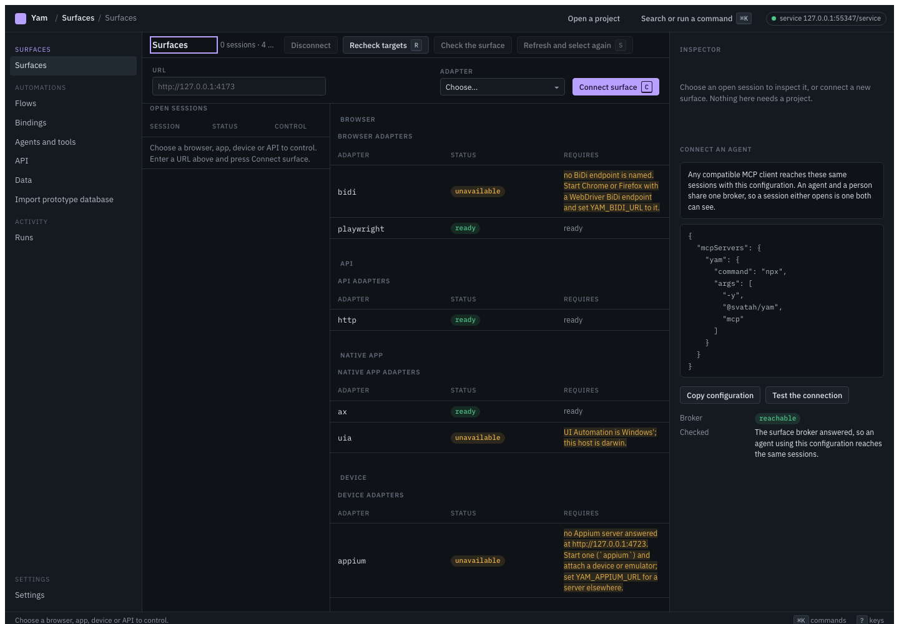
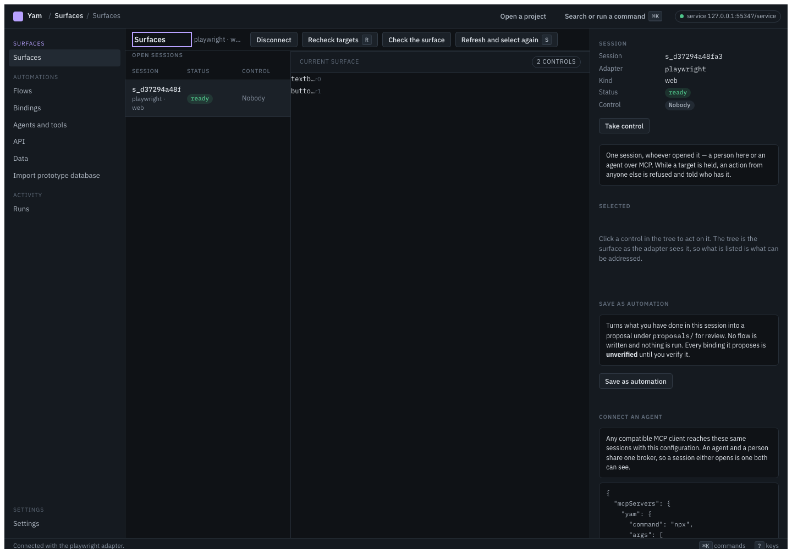
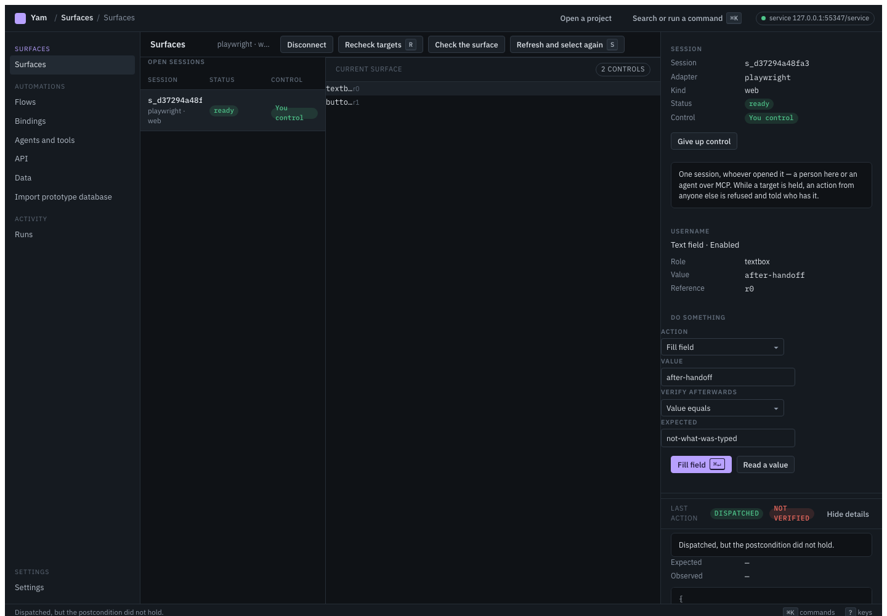

# Use the desktop app

The desktop app is an Electron client for the local service, and the service's
reference client. Every screen renders a service response or a project file, and
nothing the command line cannot produce.

**It opens on Surfaces**: connect to something, look at it, act on it, check
what happened. No project is needed for any of that, and none is opened until
you ask for one.

## Run it

Installers for macOS, Windows and Linux are attached to each release. From a
checkout:

```bash
pnpm -r build
pnpm --filter @svatah/yam-desktop start
```

Set `YAM_APP_PROJECT=<dir>` to open a project at start, and `YAM_NODE` to name
the Node runtime the packaged app should use when none of Node 22 is on `PATH`.

With no project named, the app starts a service on a private workspace of its
own and comes up on Surfaces. That workspace is not a project: nothing is
written to it, it is not remembered, and the screens that need a project say so
rather than pretending it is one.

## Surfaces



Type a URL, press **Connect surface**, and the session appears in the list with
the adapter the service actually used — not the one you asked for. Discovery
below it is grouped by what a thing *is* — a browser, an app, a device, an API —
and anything unavailable shows the exact prerequisite it is missing rather than
being hidden.



Connected, the screen is the surface's semantic tree on the left and the
selected control on the right. Choosing a control opens the form for what you
can do to it — a fill takes a value, a click takes nothing, a drag takes a
second reference — and only actions the adapter can actually complete are
offered, so "choose an action" is never a dead end.



**Dispatch and verification are two separate answers.** An action that reached
the control but was not checked reads *"Dispatched. Not verified — no
postcondition was given."* Add a postcondition and it reads *"Dispatched and
verified"* — or *"Dispatched, but the postcondition did not hold"*, keeping the
value it observed beside the one you expected. Nothing is called verified
because it was sent.

The screenshots above are the ones the verification harness takes, at
1440×1000. Regenerate them, and the ones at 1280×800 and at 200% zoom, with:

```bash
SURFACES_EVIDENCE_DIR=docs/spec/surface-first/evidence/wave-5 \
  pnpm --filter @svatah/yam-desktop exec node test/surfaces-dogfood.mjs
```

## Sharing a surface with an agent

**Connect an agent** on Surfaces offers a generic MCP configuration — the
installed binary, no plugin — and a connection test. An agent using it reaches
the same broker, so a session either of you opens is one both of you see, and
the session list says who holds each target in words: *You control*, *agent-1
controls*, *Nobody*.

While somebody holds a target, an action from anybody else is **refused and
told who has it**, never queued and never silently retried. Taking control is
an explicit handoff, and the previous holder is released and told.

## The four sections

| Section | What is under it |
|---|---|
| **Surfaces** | discovery, sessions, the action inspector, connecting an agent. Opens by default. |
| **Automations** | flows, bindings, agents and tools, API, data, import — the screens that are *about* a project. A project is chosen here, not demanded at startup. |
| **Activity** | runs and their evidence. |
| **Settings** | connections, permissions, adapters, evidence retention, preferences. |

**Save as automation**, on Surfaces, promotes what a session actually did into a
proposal for review: one step per mutation, carrying the reference acted on and
what that element was. It writes a flow and its bindings under `proposals/`,
every binding marked unverified, and it runs nothing. With no project open it
says so and points at **Open a project** rather than writing into the private
workspace.

## What it does not do yet

- There is no screenshot preview beside the tree, and no pixel actions. The
  tree is the half that is always available, including where screenshots are
  not.
- **Copy CLI** and **Copy MCP call** are not built.
- The connection test checks the broker an agent would share; it does not
  complete an MCP handshake of its own.

The [support matrix](../reference/generated/support-matrix.md) says which
adapters have been driven and how far.

## The same thing from a terminal

`yam ui` is the same screen model rendered in the terminal, and
`@svatah/yam-sdk` is the same client as a library. The HTTP API they all use is
[generated from the service's OpenAPI description](../reference/generated/http-api.md),
and `yam surface` is the same operations from a shell — see the
[surface control quick start](../../examples/surface-control/README.md).
