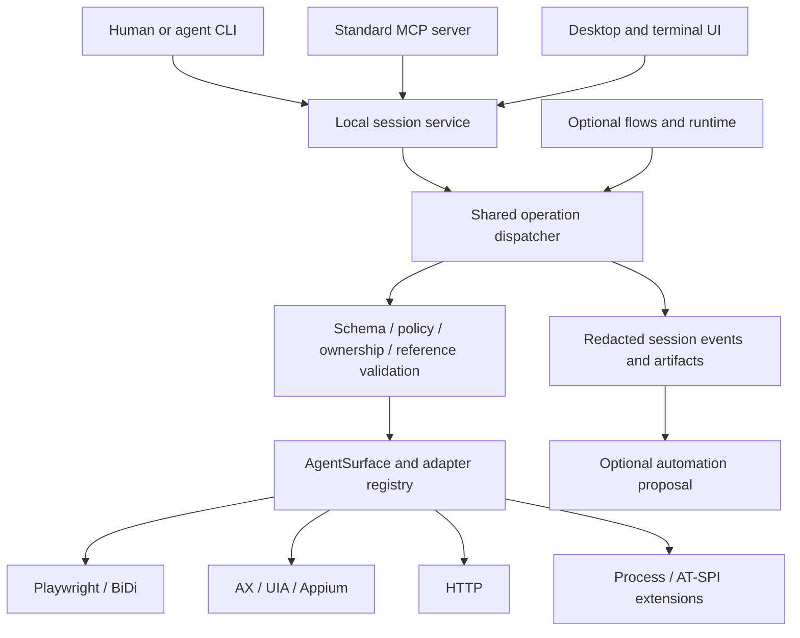

# Yam surface-first design

Status: proposed. Implements [requirements](requirements.md); evidence and current limitations are in [gap-analysis](gap-analysis.md). All interfaces below are target designs unless explicitly labelled existing.

## Architecture decision

Keep `AgentSurface`, adapters, schemas, semantic references, bindings and model-free runtime. Extract live control out of the CLI's project-loading and trajectory wrappers into a shared surface-control module. CLI, MCP and desktop become clients of that module through a local session service. The automation runtime is another consumer.



`packages/surface` remains the adapter contract, without compiler/service dependencies. Add `packages/surface-control` for operation descriptors, session management, execution coordination and normalized results; allow its composition root to receive adapter factories. `packages/service` publishes those operations and lifecycle endpoints. Move adapter registration to a small composition module reusable by service/CLI, updating import-boundary checks explicitly. The CLI must no longer be the only viable way to construct a live session. `packages/screens` models Surfaces, Connect and Activity states for desktop/TUI without importing adapters.

A service can start with no project. Project-backed automation routes load a project only when invoked. Remove surface-call dependency on loading flow files, custom steps or bindings. Desktop user preferences are not project state. Existing automation artifacts stay in the project; live session events use a private per-user state directory with a configurable retention policy and explicit export.

## Session ownership and lifecycle

The local broker persists across short CLI invocations and is discoverable through a private owner-only endpoint descriptor in the OS user-state directory. It contains endpoint/protocol metadata; credentials live in an OS credential facility or owner-only credential file, never in the repository, process arguments, browser URL or copied MCP config. Bind to loopback and authenticate every client. Start lazily; explicit `yam service start/status/stop` exposes lifecycle and diagnostics. Broker shutdown distinguishes closing launched resources from detaching user-owned resources.

Session states: `connecting → ready ↔ busy → disconnected → ready`, with `failed`, `closing` and `closed` terminal paths. Each record includes session ID, target ID, adapter/version, mode (`launch` or `attach`), authenticated owner, control lease, capabilities, timestamps, last operation and expiry. Reconnect checks target identity rather than trusting a reused port/process ID. Reuse of a closed ID fails; reconnection after broker restart invalidates old refs and reports outstanding mutations as known or unknown.

Only one mutation per target is in flight, including when two sessions refer to the same underlying application window. Lease acquisition uses broker-level atomic arbitration; a target fingerprint normalizes adapter-specific identity. A mutation already dispatched cannot be claimed undone when a lease is revoked. Finish/cancel according to capability and report the result before granting a new writer. Read-only observations during a mutation carry a revision and a “may be changing” flag. Human native interaction invalidates relevant snapshot generations when detectable; otherwise pre-dispatch revalidation remains mandatory.

## One public contract

An operation descriptor defines name, input/output JSON schemas, capability requirements, mutation/read semantics, timeout/cancellation behavior, redaction fields and documentation. Transport wrappers validate and pass the complete request to the dispatcher. Do not maintain independent partial switches like today's MCP and service wrappers.

| Operation | Proposed CLI | Proposed MCP | Service |
|---|---|---|---|
| Discover targets | `yam surface targets` | `surface_targets` | `GET /v1/targets` |
| Connect/attach | `yam surface connect` | `surface_connect` | `POST /v1/sessions` |
| List/get session | `yam surface sessions`, `yam surface session` | `surface_sessions`, `surface_session` | `GET /v1/sessions[/:id]` |
| Capabilities | `yam surface capabilities` | `surface_capabilities` | `GET /v1/sessions/:id/capabilities` |
| Observe | `yam surface snapshot` | `surface_snapshot` | `POST /v1/sessions/:id/snapshot` |
| Inspect element | `yam surface describe` | `surface_describe` | `POST /v1/sessions/:id/describe` |
| Mutate | `yam surface act` | `surface_act` | `POST /v1/sessions/:id/act` |
| Read/check | `yam surface read/check` | `surface_read/check` | Corresponding session routes |
| Screenshot | `yam surface screenshot` | `surface_screenshot` | Session route returning artifact metadata |
| Events/status | `yam surface events`, `yam surface operation` | `surface_events`, `surface_operation` | Cursor events and operation resource |
| Handoff | `yam surface control` | `surface_control` | Session control lease route |
| Close | `yam surface close` | `surface_close` | `DELETE /v1/sessions/:id` |

Use full `--session` and `--target` flags in scripts. An interactive shell may remember a selected session, but machine mode refuses an ambiguous default. Connect takes mutually exclusive explicit target ID, URL, application or device arguments; validation rejects conflicting connection modes. Adapter-specific launch details live in a typed nested options object or config file. `--input <file>`/stdin carries complex values and secrets without shell quoting hazards.

Proposed CLI journey (IDs come from previous results):

```sh
yam surface connect --url http://127.0.0.1:4173 --json
yam surface snapshot --session s_123 --json
yam surface act --session s_123 --snapshot snap_7 --ref e_12 --action fill --input action.json --json
yam surface check --session s_123 --input check.json --json
yam surface close --session s_123 --json
```

`fill` is a proposed normalized action name; existing adapter/runtime action names require an explicit alias/mapping table before implementation. Preserve established IR action semantics and reject unrecognized aliases. `action.json` supplies typed action arguments; `check.json` supplies predicate, target and deadline. The compiler is not involved.

Every ordinary result has a versioned envelope:

```json
{
  "schemaVersion": "1.0",
  "requestId": "req_19",
  "sessionId": "s_123",
  "targetId": "tab_2",
  "status": "succeeded",
  "result": { "dispatched": true, "verified": false },
  "evidence": { "beforeSnapshotId": "snap_7", "eventId": "evt_42" },
  "timing": { "totalMs": 45, "adapterMs": 32 }
}
```

Failure/refusal adds `error: {code, message, retryable, nextAction, details}` with redacted details. Domain codes include `TARGET_AMBIGUOUS`, `SESSION_CLOSED`, `PERMISSION_REQUIRED`, `UNSUPPORTED_OPERATION`, `STALE_REFERENCE`, `INVALID_ARGUMENT`, `CONTROL_BUSY`, `CHECK_FAILED`, `TIMEOUT` and `OUTCOME_UNKNOWN`. No stack trace is needed to recover. Checks returning false use `failed/CHECK_FAILED` while retaining the actual observed value. Reserve new direct-control exit codes after auditing existing codes; preserve all current flow exit codes, including healed/aborted/resume mismatch. Publish one exhaustive code mapping and test it.

MCP maps the envelope into `structuredContent` and compatible text; failed/refused tool executions carry `isError: true`. Annotations describe operations conservatively and never substitute for policy. Core inspection requires no intent; optional intent is recorded exactly as supplied. `--profile surface` is the default, `--profile automation` adds existing `yam_*` tools, and a legacy profile preserves current integrations during migration.

Pin the tested MCP revision and negotiate compatibility. Structured output and tool errors are defined by the official [tools specification](https://modelcontextprotocol.io/specification/2025-11-25/server/tools); stdio and Streamable HTTP are documented [transports](https://modelcontextprotocol.io/specification/2025-11-25/basic/transports). These links are a versioned baseline, not a claim that this is the latest revision. Before HTTP implementation, verify the chosen SDK/protocol pair and its cancellation/session behavior; REST and SSE alone do not constitute MCP.

## References and determinism

A reference identifies `(session, target, document generation, snapshot, element)`. It is opaque; clients must not parse it. The broker stores the descriptor/fingerprint that justifies it. A snapshot contains structured nodes and explicit `truncated`/continuation information, with configurable max nodes, depth, subtree and interactive-only filters.

Before a mutation, resolve the ref within its original scope and validate the live target against its captured identity and actionability. A fresh internal snapshot for logging must not silently reassign the caller's ref. Navigation, target destruction or identity mismatch invalidates the ref. If the adapter can prove identity unchanged it may accept an older snapshot; otherwise refuse and offer refresh. Model-free relocalization stays a separately disclosed recovery/proposal operation, never an invisible fallback onto a guessed target.

Dispatch and verification are distinct phases. Actions may specify a bounded postcondition evaluated through `check`. Input dispatch alone returns `verified: false`. Retry only before known non-dispatch or under a deduplicated request. Idempotency records key request hash, target, dispatch state and result; key reuse with different input is refused. Persist dispatch-start before side effect so a crash cannot imply that an action was never sent. Retention expiry is explicit and does not guarantee exactly-once external effects.

## Desktop interaction design

Primary navigation:

- **Surfaces:** available targets, connected sessions, connect action; opens by default.
- **Automations:** saved flows, recording, binding repair and tool publishing, with project selection here.
- **Activity:** recent surface operations and automation executions; defaults to a concise outcome list.
- **Settings:** connections, permissions, adapters, agent setup, evidence retention and preferences.

A visible **Connect an agent** entry also appears on Surfaces. Its panel offers copyable generic MCP configuration using the installed binary, selected scope/profile, status and a test connection. Do not ask users to choose a story to connect an agent.

The landing screen has one primary button, **Connect surface**, followed by active sessions and recently used targets. With no sessions, a short empty state explains “Choose a browser, app, device or API to control.” Discovery is grouped by platform; unavailable options display their exact prerequisite. Adapter choice is Advanced unless multiple adapters can drive the target and the tradeoff matters. The user sees the adapter actually returned by the service.

The connected screen:

```text
Surfaces > Browser · Sample app      Connected · You control     Disconnect
┌─────────────────────────────────────────┬─────────────────────────────┐
│ Current surface                         │ Selected: Username          │
│ Screenshot or semantic tree   Refresh   │ Text field · Enabled        │
│                                         │ Value [                   ] │
│ Click a control or search its name       │ [Fill field]                │
│                                         │ Verify: Value equals …      │
├─────────────────────────────────────────┴─────────────────────────────┤
│ Last action: Field filled · Value verified        Details             │
│ Recent activity …                         Save as automation         │
└───────────────────────────────────────────────────────────────────────┘
```

The tree is always available, including when screenshots are unsupported. Clicking the preview selects a semantic ref only when hit-testing maps unambiguously; otherwise show candidates. Pixel actions, where supported, are an explicit mode with lower targeting assurance, never represented as semantic determinism. Native/browser actions come from capability-driven forms: fill takes a value, click takes a chosen control, drag takes two refs, navigate takes a URL. HTTP presents method/path/typed input and response, rather than a meaningless empty UI tree. Process surfaces present terminal state when delivered.

The action inspector appears only after selection and can collapse. Avoid permanent empty inspector real estate, full trajectory tables and code-editor density on the first journey. Put request IDs, fingerprints, endpoint attribution, raw JSON and full audit data under Details. “Copy CLI” generates an executable equivalent using real session/ref values, marks expiring refs, and uses file/stdin input for secrets. “Copy MCP call” uses the identical request schema.

Open automatically takes a bounded initial snapshot. After an action, refresh relevant state and show dispatch/verification separately. Stale state offers **Refresh and select again**. Permission denial offers the platform-specific fix and **Recheck**. Busy state identifies the controlling client and offers handoff. Unknown outcome offers **Inspect current state**; never an unqualified Retry. Connect, act and disconnect show progress and expose cancellation where meaningful. No native setting changes happen automatically.

## Migration and non-goals

Deliver additively: contract and session service first, then real CLI/MCP parity, then Surfaces UI, then secondary workflow regrouping. Keep `yam mcp [project]`, existing tool names and project URLs behind documented compatibility behavior with deprecation notices on stderr. Preserve old `/surface/:session/*` routes as adapters to the new dispatcher for a stated compatibility window. Old clients keep their trajectory shape; new events use versioned schemas and an explicit exporter for trajectory compilation. Never reinterpret historical success as verified success.

Amend old acceptance tests asserting “opens into Flows” to assert Surfaces; retain separate flow-editor regression tests. Keep saved preferences/project recents and deep links resolvable. Do not rewrite user flows or binding files during migration. Reuse the UI component library and tokens where accessible; avoid a new design-system rewrite as a dependency.

This work does not add an agent planner, hosted multi-user orchestration, scheduler, queue or guarantee of identical third-party application behavior. Remote network access, new adapter classes and universal desktop control require their own tested capability scope.
